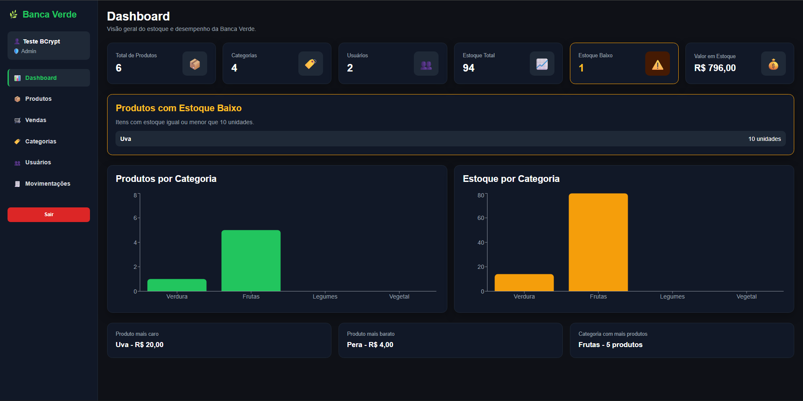
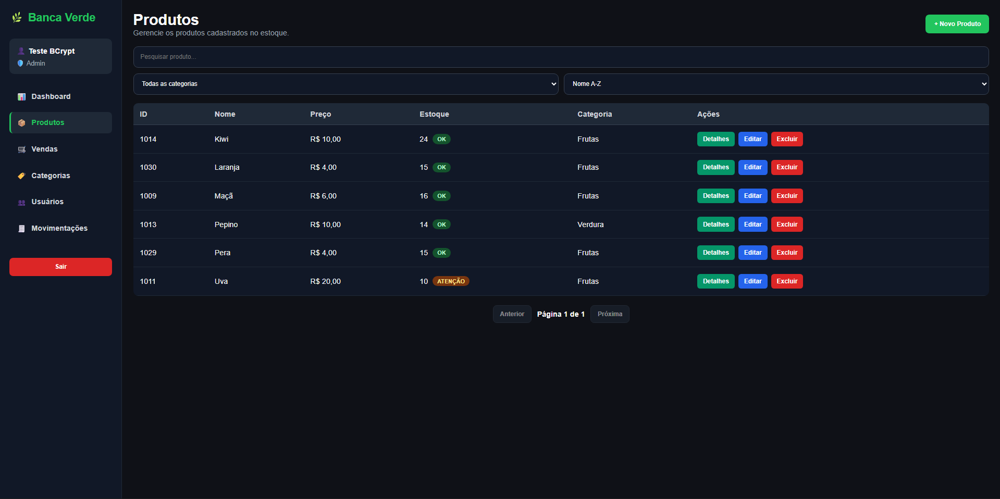
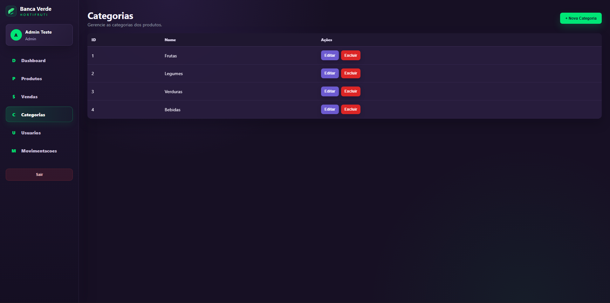
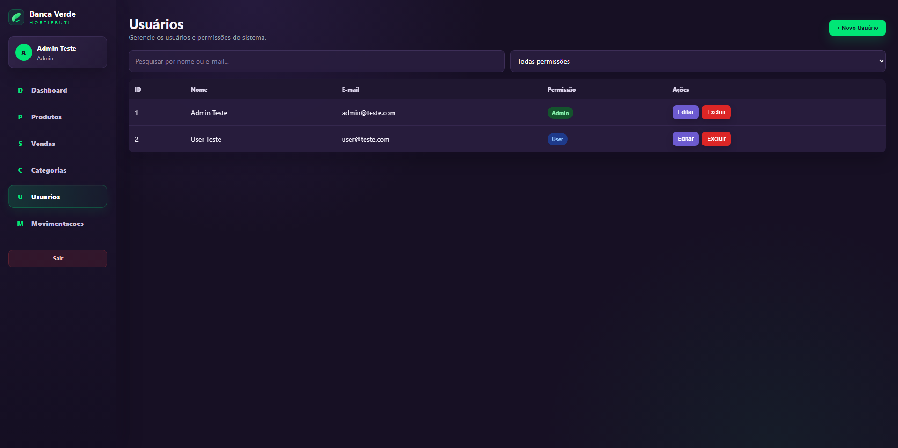
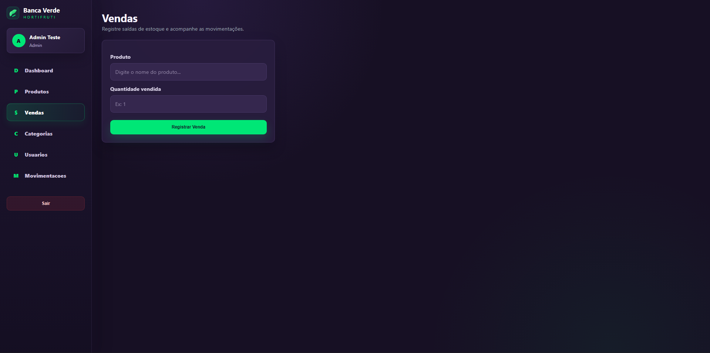
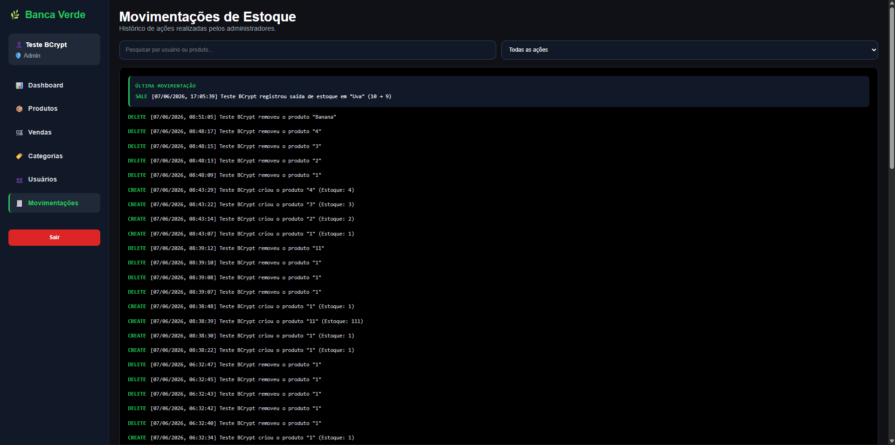

# 🌱 Banca Verde

Sistema completo de gerenciamento de estoque desenvolvido com ASP.NET Core e React.

O projeto foi criado para demonstrar conhecimentos em desenvolvimento Full Stack, autenticação JWT, controle de acesso por perfis, dashboard analítico, versionamento de API, logs e paginação.

---

# 📸 Telas do Sistema

## Login


Sistema protegido por autenticação JWT.

---

## Dashboard



Painel com métricas e gráficos em tempo real.

---

## Produtos



Gerenciamento completo de produtos.

---

## Categorias



Controle das categorias do estoque.

---

## Usuários



Gerenciamento de usuários e permissões.

---

## Vendas



Registro de saídas de estoque.

---

## Movimentações



Histórico completo de operações realizadas.

---

# 🚀 Funcionalidades

## Autenticação

- Login JWT
- Controle de acesso por perfil
- Rotas protegidas
- Roles Admin e User

---

## Produtos

- Cadastro
- Edição
- Exclusão
- Busca
- Filtro
- Ordenação
- Paginação
- Controle de estoque

---

## Categorias

- Cadastro
- Edição
- Exclusão

---

## Usuários

- Cadastro
- Edição
- Exclusão
- Controle de permissões

---

## Vendas

- Registro de vendas
- Atualização automática de estoque

---

## Movimentações Apenas Para o Usuário ADM

- CREATE
- UPDATE
- DELETE
- SALE

---

## Dashboard

- Total de produtos
- Total de categorias
- Total de usuários
- Total de estoque
- Estoque baixo
- Valor total do estoque
- Produto mais caro
- Produto mais barato
- Categoria com mais produtos
- Produto mais vendido
- Última venda
- Gráficos por categoria

---

# 🏗 Arquitetura

```text
React Frontend
        │
        ▼
ASP.NET Core API
        │
        ▼
Entity Framework Core
        │
        ▼
SQL Server
```

---

# 🔐 Segurança

O sistema utiliza:

- JWT Authentication
- Role Based Authorization
- Middleware global de exceções
- Logs de requisições com Serilog

---

# 📄 Versionamento de API

A API utiliza versionamento.

Exemplo:

```http
/api/v1/products
/api/v1/categories
/api/v1/users
```

Isso permite criar futuras versões sem quebrar clientes existentes.

---

# 📊 Paginação

Exemplo:

```http
GET /api/v1/products?page=1&pageSize=10
```

Resposta:

```json
{
  "page": 1,
  "pageSize": 10,
  "totalRecords": 150,
  "totalPages": 15,
  "data": []
}
```

---

# 📝 Logs

Implementados utilizando Serilog.

Exemplo:

```text
[INF] HTTP GET /api/v1/products
[INF] HTTP POST /api/v1/products
[ERR] Erro inesperado...
```

---

# 🛠 Tecnologias Utilizadas

## Backend

- ASP.NET Core
- Entity Framework Core
- SQL Server
- JWT
- Swagger
- Serilog
- API Versioning

## Frontend

- React
- React Router
- Axios
- React Toastify
- Recharts
- SweetAlert2

---

# 📂 Estrutura do Projeto

```text
BancaVerde

├── backend
│   ├── Controllers
│   ├── DTOs
│   ├── Models
│   ├── Data
│   ├── Responses
│   ├── Middlewares
│   └── Logs
│
├── frontend
│   ├── Pages
│   ├── Components
│   ├── Routes
│   ├── Services
│   └── Assets
│
└── README.md
```

---

# ⚙ Como Executar

## Backend

```bash
dotnet restore
dotnet ef database update
dotnet run
```

Swagger:

```text
https://localhost:5092/swagger
```

---

## Frontend

```bash
npm install
npm run dev
```

---

# 🔮 Melhorias Futuras

- Exportação para Excel
- Relatórios PDF
- Upload de imagens de produtos
- Notificações em tempo real
- Dashboard avançado

---

# 👨‍💻 Autor

Guilherme Cavalcante

Projeto desenvolvido para estudo e demonstração de conhecimentos em desenvolvimento Full Stack com ASP.NET Core e React.